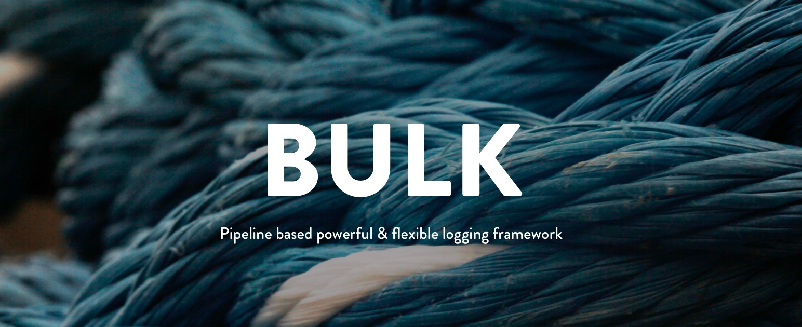
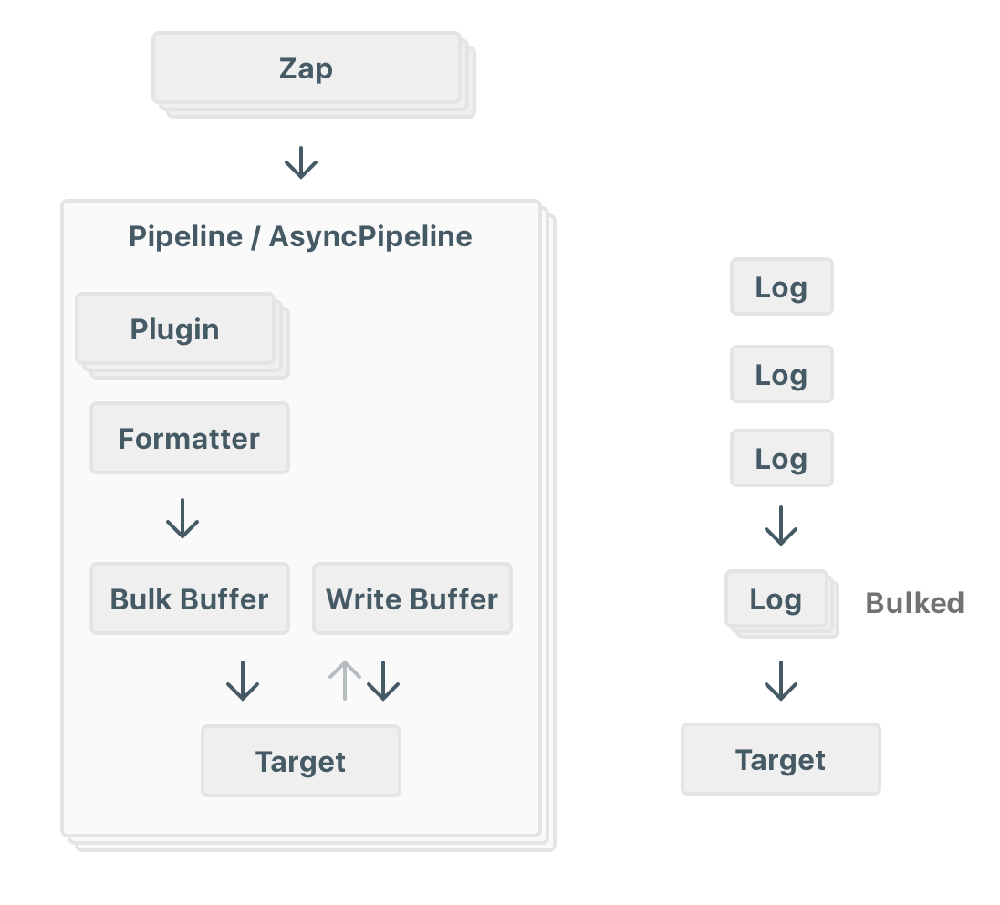

<p align="center">
  
</p>


# Bulk
[](https://travis-ci.org/muukii/Bulk)
[](http://cocoapods.org/pods/Bulk)
[](https://github.com/Carthage/Carthage)

---

> 🚨⚠️ WARNING ⚠️🚨 This project is in a prerelease state. There is active work going on that will result in API changes that can/will break code while things are finished. Use with caution.

---

Bulk is *a pipeline based* powerful & flexible logging framework.<br>
It has basic functions as a *Logger*.<br>
In addition, it can output logs in bulk.<br>
This is useful when sending logs to a server.<br>



# Usage

## Basic Usage

```swift
let Log = Logger()

// Setup output targets

// Logging synchronously
Log.add(pipeline:
  Pipeline(
    plugins: [
      /* Some plugins */
      /* MyPlugin() */
    ],  
    targetConfiguration: .init(formatter: BasicFormatter(), target: target),
  )
)

// Logging asynchronously

Log.add(pipeline:
  AsyncPipeline( // <-- 😎< asynchronously
    plugins: [
      /* Some plugins */
      /* MyPlugin() */
    ],  
    targetConfiguration: .init(formatter: BasicFormatter(), target: target),
    queue: .global() // <-- 🤓< Specify DispatchQueue
  )
)

Log.verbose("Something log")
Log.debug("Something log")
Log.info("Something log")
Log.warn("Something log")
Log.error("Something log")

// We can use this like Swift.print()

Log.verbose("a", "b", 1, 2, 3, ["a", "b"]) // => a b 1 2 3 ["a", "b"]
```

## Pipeline

`Pipeline` perform sending `Log` from Logger to Target.

**Sequence**
📄 => Logger => [Plugin] => BulkBuffer? => WriteBuffer? => Formatter<T> => Target<T> => 📄

### Pipeline

`Pipeline` is basic class.

Sequence perform on the queue that called Logger's method.

### AsyncPipeline

`AsyncPipeline` perform sequence on specified queue.

📄 => Logger => **Dispatch to specified queue** => [Plugin] => BulkBuffer? => WriteBuffer? => Formatter<T> => Target<T> => 📄

## Buffer

* `NoBuffer`
* `MemoryBuffer`
* `FileBuffer`

### Bulk Buffer

For send `formatted strings` to `Target`.

### Write Buffer

For waiting for processing `Target`.

If `Target` is sending logs to the server,
You may not be able to send all of them.
`Write Buffer` will be useful in the case.

In the case of FileBuffer,
if the process ends due to an exception, it will be sent to the `Target` at the next timing.

### Set Buffer

```swift
let Log = Logger()

Log.add(pipeline:
  Pipeline(
    plugins: [],  
    bulkConfiguration: .init(
      buffer: MemoryBuffer(size: 10),
      timeout: .seconds(10)
    ), // Send to Target every 10 Logs.
    targetConfiguration: .init(
      formatter: BasicFormatter(),
      target: ConsoleTarget(),
      buffer: FileBuffer(size: 40, filePath: "/path/to/bulk-buffer.log")
    ) // Wait for writing up to 40 Logs.  
  )
)
```

### if we don't need `Buffer`?

It's ok.
Use `NoBuffer`

## Customization

### Plugins


```swift
class MyPlugin: Plugin {
  func map(log: Log) -> Log {
    var log = log
    log.body = "Tweaked:: " + log.body
    return log
  }
}
```

Example: Create `Log.Level` based filter.

```swift
public struct LevelFilterPlugin: Plugin {
  
  public let ignoreLevels: [Log.Level]
  
  public init(ignoreLevels: [Log.Level]) {
    self.ignoreLevels = ignoreLevels
  }
  
  public func apply(log: Log) -> Log {
    if ignoreLevels.contains(log.level) {
      var log = log
      log.isActive = false
      return log
    }
    return log
  }
}
```

### Custom Formatter

Step of `Log` -> any type

Create customized formatter using `Formatter` protocol

```swift
public protocol Formatter {
  
  associatedtype FormatType
  
  func format(log: Log) -> FormatType
}
```

### Custom Target

Create customized target using `Target` protocol.

```swift
public protocol Target {
  
  associatedtype FormatType
  
  func write(formatted items: [FormatType], completion: @escaping () -> Void)
}
```

Example

```swift
open class ConsoleTarget: Target {
    
  public init() {
    
  }
  
  open func write(formatted strings: [String], completion: @escaping () -> Void) {
    strings.forEach {
      print($0)
    }
    
    completion() // Important
  }
}
```

### Custom Buffer

We can create customized `Buffer`.

Example,

Use Realm or CoreData instead of `FileBuffer`
It will be faster than `FileBuffer` (maybe)

// TODO:

## Built-in Libraries

- Formatters
  - BasicFormatter
  - RawFormatter

- Targets
  - ConsoleTarget
  - FileTarget
  - NSLogTarget
  
- Buffers
  - NoBuffer
  - MemoryBuffer
  - FileBuffer (Using SeparatorBasedLogSerializer)

# Installation

## CocoaPods

```
pod "Bulk"
```

## Carthage

```
github "muukii/Bulk"
```

## SwiftPackageManager

```swift
import PackageDescription

let package = Package(
  name: "MyApp",
  dependencies: [
    .Package(url: "https://github.com/muukii/Bulk.git", majorVersion: 0),
  ]
)
```

# Development

## Ubuntu

Use docker

```sh
$ cd /path/to/Bulk
$ docker run --rm -it --name swift -v $PWD:/local/dev --workdir "/local/dev" swift:3.1 /bin/bash
$ swift build
```

# LICENSE

Bulk Framework is released under the MIT License.
